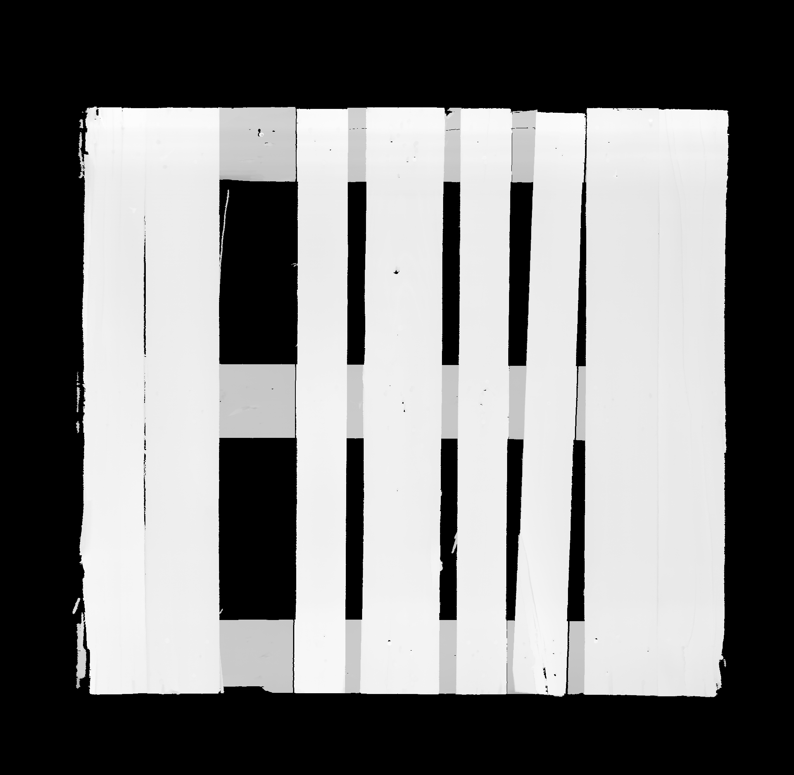
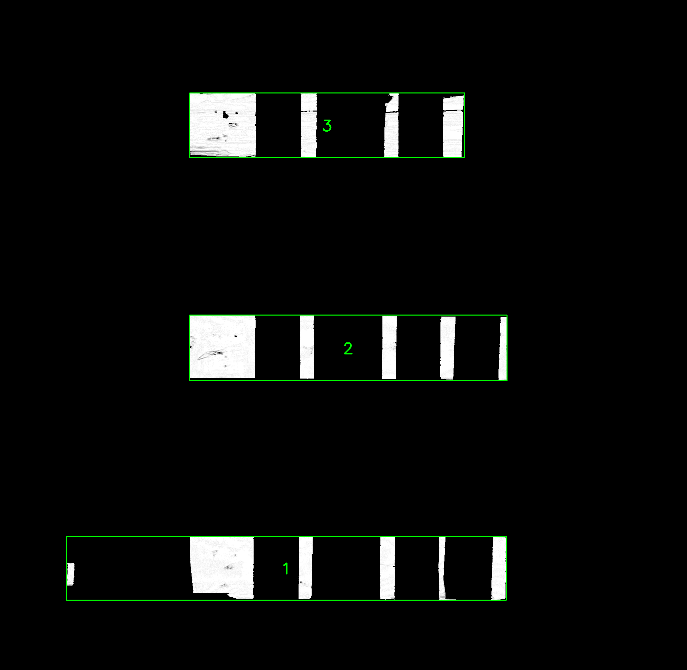
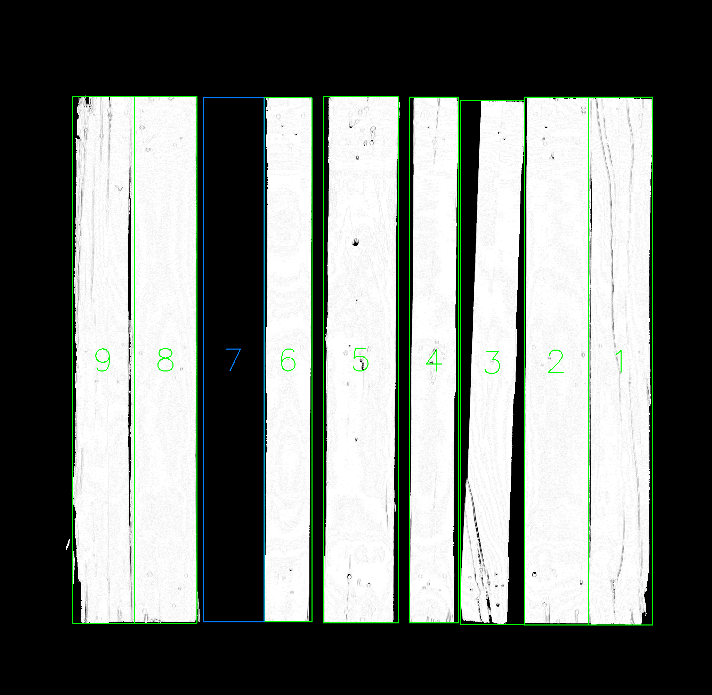
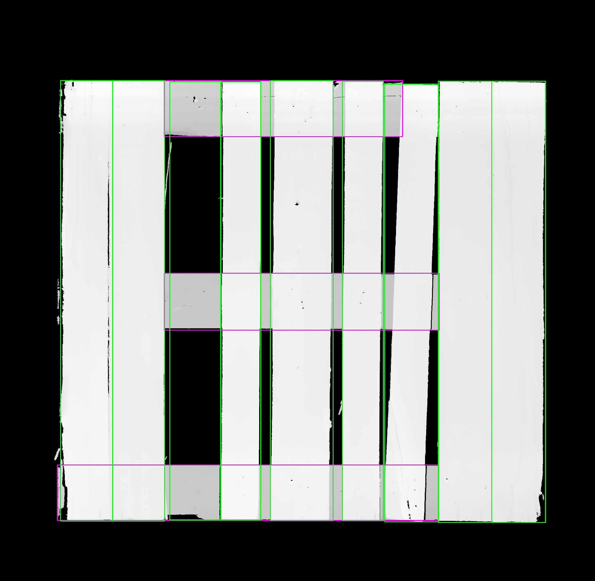

# Pallet Board Detection 

This project provides a complete pipeline for detecting **horizontal and vertical boards** (pallets) from TIFF images. It uses **OpenCV**, **NumPy**, and Python to process images, detect edges, extract line structures, group boards, handle fragmented or missing boards, and generate labeled visualizations.

---

## Features

- Load and normalize 16-bit TIFF images.
- Detect edges using Sobel operators.
- Extract vertical and horizontal line masks.
- Clean lines using morphological operations.
- Extract horizontal boards, group them into lines, and filter invalid lines.
- Extract vertical boards, merge fragmented boxes, and fill missing gaps.
- Generate labeled images showing detected boards and virtual pallets.
- Supports saving intermediate results and final visualizations per image.

---

## Installation

1. Clone this repository:

```bash
git clone https://github.com/yourusername/pallet-board-detection.git
cd pallet-board-detection
```

2. Create a Python virtual environment (recommended):

```bash
python -m venv venv
source venv/bin/activate  # Linux/macOS
venv\Scripts\activate     # Windows
```

3. Install required packages:

```bash
pip install -r requirements.txt
```

4. Required libraries:

- `opencv-python` – Image processing and computer vision operations.
- `numpy` – Numerical computations, arrays, and image manipulation.
- `matplotlib` – Visualization of images and plots.

---


## Project Structure

```bash
pallet-board-detection/
│
├─ src/                       # Source code
│  ├─ image_utils.py          # Loading, normalization, and saving images
│  ├─ edge_detection.py       # Sobel edges, line extraction, and cleaning
│  ├─ horizontal_boards.py    # Extraction and grouping of horizontal boards
│  ├─ vertical_boards.py      # Extraction, merging, and filling vertical boards
│  ├─ pallet_analysis.py      # Helper functions: merge, connect, remove nested boxes
│
├─ config.py                  # Input and output folder definitions
├─ main.py                    # Main pipeline for processing all images
├─ requirements.txt           # Dependencies
└─ README.md                  # Project documentation
```

---

## Usage

1. Place your TIFF images in the `INPUT_FOLDER` defined in `config.py`.
2. Run the main script:
```bash
python main.py
```

3. The pipeline will:

- **Load and normalize each image** from the `INPUT_FOLDER`.
- **Compute Sobel edges** in both X and Y directions to detect gradients.
- **Extract rough vertical and horizontal masks** using intensity thresholds.
- **Clean line masks** with morphological operations and remove unwanted edges.
- **Extract horizontal boards**, group them into lines, filter small or invalid lines, and generate labeled images.
- **Extract vertical boards**, split oversized boxes, remove nested boxes, merge fragmented verticals, and fill missing gaps.
- **Combine labeled boards** onto the normalized image with horizontal boards in pink and vertical boards in green.
- **Save results** in a structured folder per image under `OUTPUT_FOLDER`, including:
  - `*_normalized.png` – normalized input image:
    
  - `*_horizontal.png` – labeled horizontal boards.
    
  - `*_vertical.png` – labeled vertical boards.
    
  - `*_combined_boards.png` – visualization with both horizontal and vertical boards.
    

---

## Notes

- The project is optimized for **grayscale TIFF images**, but can be adapted for other formats.
- **Adjustable parameters:**
  - Morphological kernel sizes (`ksize`) for connecting fragments.
  - Area thresholds for filtering contours.
  - Tolerances for merging broken vertical boards.
  - Intensity ranges for line extraction.
- Virtual boards (to fill gaps) are marked differently in the labeled images for visual distinction.
- Each processed image has its own subfolder to keep outputs organized.

---

## License

MIT License © 2025 Vicente Brisa Saez  
GitHub: [https://github.com/Vicen-te](https://github.com/Vicen-te)